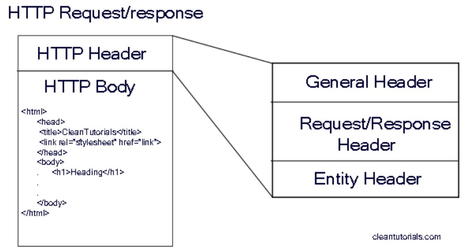
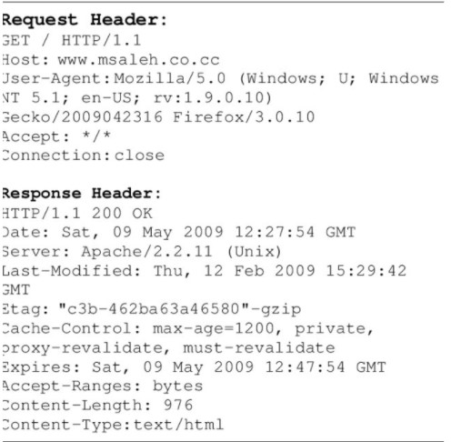

# Práctica 7: Servidor HTTP basico

> Primera Parcial

- FACULTAD DE TELEMATICA
- INGENIERÍA EN SOFTWARE
- “4ºG”
- PROGRAMACIÓN WEB
- CATEDRATICO: ULIBARRI IRETA CARLOS
- AGUIRRE ROMERO RAMÓN ALEJANDRO

## OBJETIVO

- NPM
- Node Servers

> ENTREGA: DOMINGO 13 DE MARZO DEL 2022

## INFORMACIÓN ADICIONAL

- HTTP

  - HTTP es un protocolo de acceso para las páginas web a través de Internet. Fue diseñado para la comunicación entre los navegadores y servidores web, aunque puede ser utilizado para otros propósitos también. Sigue el clásico modelo cliente-servidor, en el que un cliente establece una conexión, realizando una petición a un servidor y espera una respuesta del mismo

- Servidor HTTP

  - Con "Servidor web" podemos referirnos a hardware o software, o a ambos trabajando juntos.

    1. En cuanto a hardware, un servidor web es una computadora que almacena los archivos que componen un sitio web (ej. documentos HTML , imágenes, hojas de estilos CSS y archivo JavaScript) y los entrega al dispositivo del usuario final.
    2. En cuanto a software, un servidor web tiene muchas partes encargadas del control sobre cómo tienen acceso los usuarios a los archivos, por lo menos un servidor HTTP.

- Formato del paquete HTTP (esquema)

  - En HTTP/1.1, estos mensajes eran enviados de forma abierta a través de la conexión. En HTTP/2.0 los mensajes se conforman mediante tramas binarias codificadas para aumentar la optimización y rendimiento de la transmisión.

- HTTP Request

  - HTTP define un conjunto de métodos de petición para indicar la acción que se desea realizar para un recurso determinado. Aunque estos también pueden ser sustantivos, estos métodos de solicitud a veces son llamados HTTP verbs. Aunque hay varios métodos de HTTP para recuperar datos de un servidor, las dos más utilizados son GET y POST.

- HTTP Response

  - Los códigos de respuesta HTTP indican si una determinada petición HTTP se ha completado correctamente o no. Las respuestas se clasifican en cinco clases: respuestas informativas, respuestas de petición correcta, redirecciones, error del cliente y error del servidor.

- Puerto TCP

  - TCP usan números de puertos para identificar un socket, es decir, una aplicación que emite datos o que recibe datos. Los puertos TCP van desde el 0 hasta el 65535, pero tenemos tres tipos de puertos diferentes:

    - Puertos conocidos: del 0 al 1023. Estos puertos están reservados por la IANA para determinadas aplicaciones.
    - Puertos registrados: de 1024 al 49151. Estos puertos están reservados para sistemas gestores de bases de datos, BitTorrent, y muchas otras aplicaciones.
    - Puertos privados: de 49152 a 65535. Estos puertos no están reservados por ninguna aplicación, y puedes usarlos libremente.

- Métodos HTTP

  - The different operations that can be done with HTTP: GET, POST, and also less common requests like OPTIONS, DELETE, or TRACE.
    - GET: El método GET solicita una representación de un recurso específico. Las peticiones que usan el método GET sólo deben recuperar datos.
    - HEAD: El método HEAD pide una respuesta idéntica a la de una petición GET, pero sin el cuerpo de la respuesta.
    - POST: El método POST se utiliza para enviar una entidad a un recurso en específico, causando a menudo un cambio en el estado o efectos secundarios en el servidor.
    - PUT: El modo PUT reemplaza todas las representaciones actuales del recurso de destino con la carga útil de la petición.
    - DELETE: El método DELETE borra un recurso en específico.
    - CONNECT: El método CONNECT establece un túnel hacia el servidor identificado por el recurso.
    - OPTIONS: El método OPTIONS es utilizado para describir las opciones de comunicación para el recurso de destino.
    - TRACE: El método TRACE realiza una prueba de bucle de retorno de mensaje a lo largo de la ruta al recurso de destino.
    - PATCH: El método PATCH es utilizado para aplicar modificaciones parciales a un recurso.

## EXPLICACIÓN DEL PROCESO

1. Crea una carpeta llamada "httpServer"

2. Inicializa NPM con npm init

3. Instala el paquete http con npm i http

4. Crea un nuevo archivo app.js

5. Utiliza el require con el http y luego se crea un servidor para despues utilizar una funcion que reciba req y res.

6. Dentro de la funcion se coloca un writeHead en el res con 200 y un 'Content-Type' asi como 'text/plain' por ultimo coloca un res.end con el texto Hello world

7. Coloca un listen en el puerto 1337 y ejecuta el node app.js

8. Ahora cambia la funcion para que sea de notación de la flecha

9. Abre el navegador y escribe localhost:1337, observa lo sucedido

10. Ahora entra en las herramientas del desarrollador y revisa la seccion de headers, Explica lo ocurrido

## RECURSOS

- https://www.npmjs.com/
